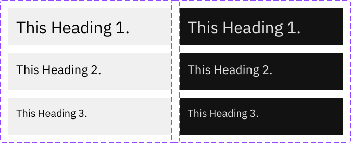

# Components

## Headings

-   Heading common
    -   min-width: 320
-   Heading level 1
    -   mobile: text-3xl / 30px,
-   Heading level 2
    -   mobile: text-2xl / 24px,
-   Heading level 3
    -   mobile: text-xl / 20px,
